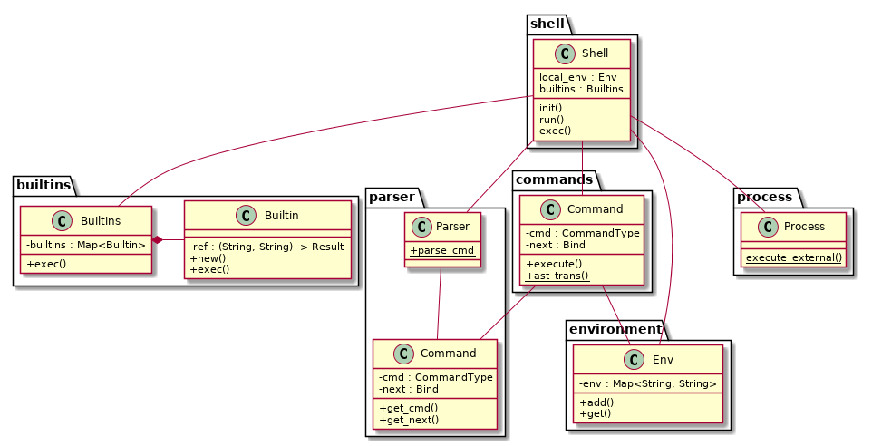

Software Design. HW 1: CLI
--------------------------

> Разработать архитектуру и реализовать интерпретатор командной строки из презентации.
> 
> Ожидается:
> - архитектурное описание (диаграмма с классами и их взаимосвязями, немного текста, описывающего детали реализации)
> - работающий интерпретатор
> - поддержка команд из презентации
> - работающие кавычки и переменные окружения
> - юнит-тесты, комментарии в коде

Встроенные комманды:
- `cat [FILE]` -- вывести содержимое файла;
- `echo` -- вывести аргумент;
- `wc [FILE]` -- вывести количество строк, слов и байт в файле;
- `pwd` -- вывести текущую директорию;
- `exit` -- выйти из интерпретатора.

Поддержка:
- Переменные окружения (локальные, глобальные): `var=value`, `$var`.
- Пайпы `|`.
- Аргументы в кавычках. `"` -- внутри допустима замена переменных окружения; `'` -- внутри строки ничего заменять не нужно.

Установка
---------

Для установки системы сборки можно использовать [rustup](https://www.rust-lang.org/tools/install).

Сборка
------

Команда `cargo build` соберёт проект.

Команда `cargo run` запустит проект.

Диаграмма
---------

